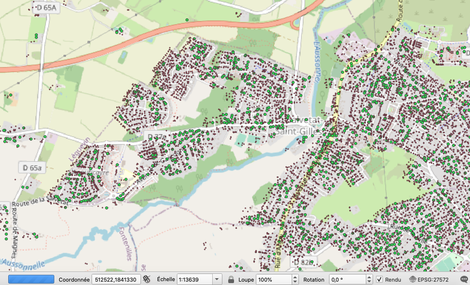
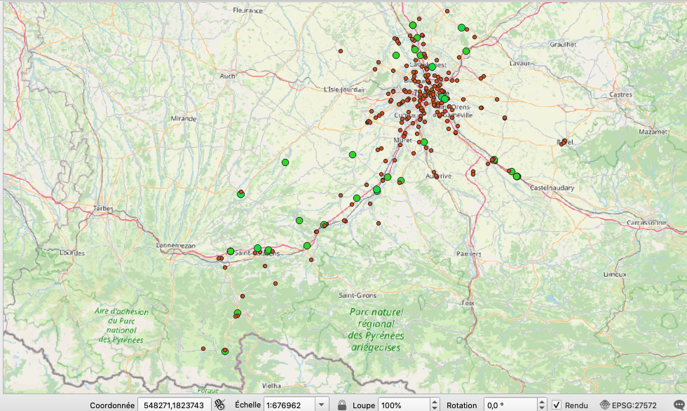

  
# planif

This is two python scripts using openstreertmap data and ocsge data

## install
 

`sudo dnf install postgresql-server postgresql-contrib
sudo systemctl enable postgresql
sudo postgresql-setup --initdb --unit postgresql
sudo systemctl start postgresql`
>install postgresql
 

`sudo dnf install osm2pgsql
sudo dnf install ogr2ogr`
>install osm2pgsql and ogr2ogr
 
 
`sudo dnf install postgis` 
>install postgis
 

`sudo dnf install java-11-openjdk-devel
sudo yum -y install wget
wget https://dbeaver.io/files/dbeaver-ce-latest-stable.x86_64.rpm
sudo rpm -Uvh ./dbeaver-ce-latest-stable.x86_64.rpm`
>install dbeaver
 

`sudo -u postgres createuser osmuser
sudo -u postgres createdb --encoding=UTF8 --owner=osmuser gis
sudo -u postgres psql osm --command='CREATE EXTENSION postgis;'
sudo -u postgres psql osm --command='CREATE EXTENSION hstore;'`
>config postgresql
 

`si soucis de connection dans dbeaver:
host    all             all             127.0.0.1/32            trust  
in /var/lib/pgsql/data/pg_hba.conf
créer database dans dbeaver 
sudo -i -u postgres 
psql -d gis -c 'CREATE EXTENSION postgis; CREATE EXTENSION hstore;' -1`
>si soucis de connection dans dbeaver et/ou soucis de owner
 

## process osm and ocsge data

`osm2pgsql -d gis -C 53 --create --drop midi-pyrenees-latest.osm.pbf -p osm -E 4326 --slim` 
>create a gis database with osm data (midi-pyrenees)
 

`ALTER TABLE osm_polygon 
ADD geom VARCHAR;
UPDATE osm_polygon SET geom = ST_AsText(ST_Transform(way, 27572));`
>convert geometry to 27572
 

`create table hautegaronne as (SELECT * FROM osm_polygon WHERE name = 'Haute-Garonne')` 
>create a table of haute garonne department
 

`ogr2ogr -nlt POLYGON -append -t_srs "EPSG:27572" -f PostgreSQL PG:"dbname=gis host=localhost user=user password=pw" OCS_GE_1-1_2013_SHP_LAMB93_D031_2018-03-12/OCS_GE/1_DONNEES_LIVRAISON_2018-03-00296/OCSGE_1-1_SHP_LAMB93_D31-2013/OCCUPATION_SOL.shp` 
>add ocsge data of haute-garonne to gis database
 

`SELECT osm.*, h.* FROM osm_fuel osm JOIN hautegaronne h ON ST_contains(h.way, ST_GeometryFromText(osm.geom,27572));` 
>select fuel stations in hautegaronne
 

`create table hgb as (SELECT osm.osm_id, osm.name, osm.building, osm.geom FROM osm_polygon osm JOIN hautegaronne h ON ST_contains(ST_GeometryFromText(h.geom,27572), ST_GeometryFromText(osm.geom,27572)));` 
>create table of buildings in hautegaronne
 

`psql -A --command "SELECT osm_id, name, building as type, st_astext(geom) as geometry FROM osm_polygon WHERE building IS NOT NULL" --dbname gis --username user --output building.csv --field-separator '#'` 
>extract building.csv from gis database
 

`psql -A --command "SELECT ogc_fid,id,code_cs,millesime,source, st_astext(wkb_geometry) as geometry FROM occupation_sol WHERE code_cs in ('CS2.2.1')" --dbname gis --username user --output occsol.csv --field-separator '#'` 
>extract occsol.csv from gis database
 

`psql -A --command "SELECT osm_id, name, amenity  as type, st_astext(way) as geometry FROM osm_point WHERE amenity in ('fuel','charging_station') UNION ALL SELECT osm_id, name, amenity  as type, st_astext(way) as geometry FROM osm_polygon WHERE amenity in ('fuel','charging_station') UNION ALL SELECT osm_id, name, shop  as type,st_astext(way) as geometry FROM osm_point WHERE shop in ('fuel') UNION ALL SELECT osm_id, name, shop as type, st_astext(way) as geometry FROM osm_polygon WHERE shop in ('fuel')" --dbname gis --username user --output carfuel.csv --field-separator '#'` 
>extract carfuel.csv from gis database
 

## python usage

`sudo dnf install python3-pip
python3 -m venv .venv
source .venv/bin/activate
pip3 install -r requirements.txt`
>install python and requirements in virtualenv
 

`python geotherm.py -b building.csv -o occsol.csv` 
>process building.csv to append a column 'geot' set to yes if the building can accept a geothermal installation (has a garden)
 

`python stations.py -s stations.csv -o occsol.csv` 
>process stations.csv to append a column 'p2g' set to yes if the fuel station can accept a power to gas installation (has 12ha of land available at a 1 km distance)
 

## results
building accepting geothermy:

carfuel stations accepting power to gas

